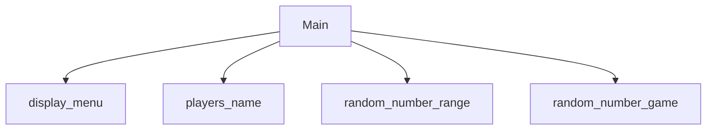

# Random Number Game
Evan Brown, Braxton Hartley

## Random Number Game Description
 it will generate a random number and keep track of the turns with two players. It will tell you which one was closer I guess and who won.

### Random Number Game Flowchart

#### Function Diagrams

| `function name1`    |               |  author     |
| ------------------ | ------------- | ------------ |
| `argument:type`    | takes input from the user for ____  |              |
| `time:integer`     | calculates ______  | outputs ____             |
| `name:string`      | takes input for name ___ | returns total |
***
| `function name2`    |               |     author   |
| ------------------ | ------------- | ------------ |
| `argument:type`    | takes input from the user for ____  |              |
| `time:integer`     | calculates ______  | outputs ____             |
| `name:string`      | takes input for name ___ | returns total |
***
