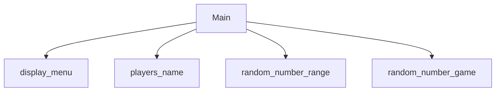

# Random Number Game
Evan Brown, Braxton Hartley

## Random Number Game Description
 it will generate a random number and keep track of the turns with two players. It will tell you which one was closer I guess and who won.

### Random Number Game Flowchart

#### Function Diagrams

| `display_menu`    |               |  author     |
| ------------------ | ------------- | ------------ |
| `Argument: none`    | We are displaying the main menu and taking their choice inside of it to return to main |    Braxton Hartley          |
***
| `players_name`    |               |     author   |
| ------------------ | ------------- | ------------ |
| `Enter a player's name`    | takes input from the user for Name  |    Evan Brown          |
| `name:string`      | takes input for name player | returns total players |
***
| `random_number_range`    |               |     author   |
| ------------------ | ------------- | ------------ |
| `Argument:input 2 numbers to become the range of the game`    | Sets a new range (input 2 numbers)  |   Braxton Hartley           |
***
| `Guessing game`    |               |     author   |
| ------------------ | ------------- | ------------ |
| `Player continuously inputs numbers till correct`    | takes input from the user for _a number_  |   Evan Brown           |
| `Range val`     | calculates _if the guessed number is higher or lower than the chosen one__  | outputs _highter or lower text_            |
| `win`      | takes input for name _correct number__ | returns win messenger and main menu |
***
